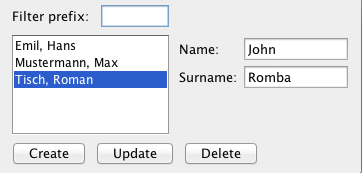

# Enodo Code Challenge
We would like you to complete the following tasks:

## Counter 
Build a component containing a label or read-only input and a button. The initial value of the input should be `0` and every button click should increase that value by `1`

## Temperature Converter
Build a component with two inputs representing the temperature in celsius (`C`) and fahrenheit (`F`), respectively. 
- When a user enters a value into the `C` input the corresponding value in `F` is automatically updated and vice versa.
- If something other than a number is entered into either field no conversion should happen an inline error should be shown alerting the user of the problem field.


## Flight Booking
Build a component containing a combobox `C` with the two options `“one-way flight”` and `“return flight”`, two textfields `T1` and `T2` representing the start and return date, and a button `B` for submitting the selected flight. 

The functionality is as follows:
- `T2` is enabled if `C`’s value is `“return flight”`.
- When C has the value `“return flight”` and `T2`’s date is before `T1`’s then `B` is disabled. 
- When a non-disabled input `T` has an ill-formatted date then `T` is colored red, an inline error message is shown, and `B` is disabled.
- When clicking `B` a message is displayed informing the user of his selection 
  - example: You have booked a one-way flight on 01-31-2021.
- Initially, `C` has the value one-way and `T1` as well as `T2` have the same date

## Timer
Build a component containing a gauge `G` for the elapsed time `ET`, a label `L` which shows the elapsed time as a number, a slider `S` by which the duration `D` of the timer can be adjusted while the timer is running and a reset button `RB`. 
- Adjusting `S` must must update `D` in real time.
  - While moving `S` the filled amount of `G` should also change in real time.
- When `ET ≥ D` the timer should stop and `G` should be full.
  - If `D` is increased to the point that `D > ET`, the timer restarts to tick until `ET ≥ D` is true.
- Clicking `RB` will reset `ET` to 0.

## CRUD
Build a component containing the following elements:
- Inputs:
  - `prefix`
    - Labeled as `Filter Prefix`
  - `name`
    - Labeled as `First Name`
  - `surname`
    - Labeled as `Last Name`
- List Box
  - `LB`
- Buttons
  - `Create`
  - `Update`
  - `Delete`

- `LB` presents a view of the data in the database that consists of a list of names. At most one entry can be selected in `LB` at a time.
- By a value into`prefix` the user can filter the names whose `surname` start with the entered prefix
  - This should happen immediately without having to submit the prefix with enter.
- Clicking `Create` will append the resulting name from concatenating the strings in `name` and `surname` to `LB`.
- `Update` and `Delete` are enabled if an entry in `L` is selected. 
- `Update` will not append the resulting name but instead replace the selected entry with the new name.
- `Delete` will remove the selected entry. 
- The layout of this component should be something like the screenshot below.
  - In particular, `LB` must occupy all the remaining space.



## Rules
The rules are as follows:
- Must be done with VueJS
- All components must be loaded onto a single page
- Components must function as described above

## Style
- Keep it simple or be creative! It's up to you. 
- We have included [Element UI](https://element.eleme.io/#/en-US/component/installation) but you can use any framework (or none at all) you want.


# Download, Setup, and submission
You can either fork this project by clicking on the `Use this Template` button or clone/download it as a zip file. 

For submission you can provide a link to the forked project or send it as a zip file.

## Project setup
- Install [VueCLI](https://cli.vuejs.org/guide/installation.html)
- Install packages
```
// Install packages
npm install
```
- Run the app
```
npm run serve
```

## Good Luck!
If you have any questions please reach out!
